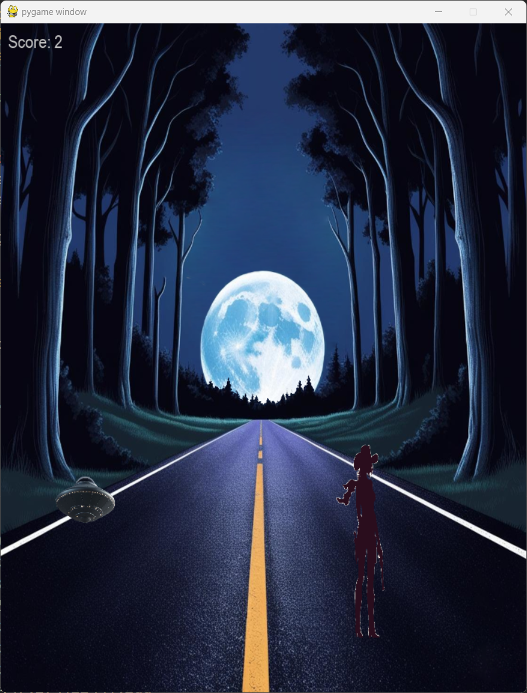

# NeuroHackathon -- CATCH THE ALIEN

It's a relaxing game, where user equipped with *BA HALO* device, can control
main character. Three moves are allowed:
1. Shoot -- blink with two eyes simultaneously to shoot alien, that is 
on your side of the road. Be aware, you cannot shoot UFO vehicle!
2. Move left -- When on right side of the road, blink with your left eye to change sides.
3. Move right -- When on left side of the road, blink with your right eye to change sides.



Your quest is to catch as many aliens as possible.

## Installation

Clone repository, create python virtual environment (python $\geq$ 3.10) and install dependencies.
```
git clone https://github.com/Sz-Lasota/heroes-of-the-brain.git
cd heroes-of-the-brain
python -m venv venv
./venv/Scripts/activate
pip install -r requirements.txt
```

SDK have to be installed according to documentation, provided by BrainAccess: [here](https://www.brainaccess.ai/software/brainaccess-sdk/).

Before running the game, you should download BrainAccess Board, and connect your HALO device to it.

Now you can run your game with python:
```
python main.py
```
